```{r setup, include=FALSE}
options(htmltools.dir.version = FALSE)
knitr::opts_chunk$set( echo = FALSE, 
                       warning = FALSE,
                       message = FALSE)
library(tidyverse)
```

# Amylase Enzymes

For brewing there are two prominent amylase enzymes:  

- $\beta$-amylase  

- $\alpha$-amylase

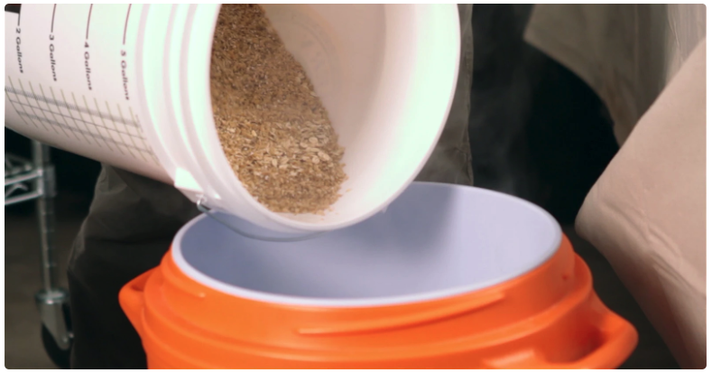

---
class: center, middle

# Mashing Temperatures

.pull-left[
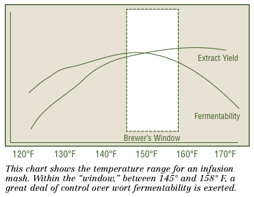
]

.pull-right[
```{r}
df <- tribble(
  ~Temperature, ~Activity,
  #-----------|-----------
"68 - 105 °F", "ferrulic acid rest",
"113 - 122 °F" , "protein and beta glucanase rest",
"144 - 149 °F",  "fermentability rest",
"158° - 167 °F", "extract rest",
"172°F", "mash-off temperature"
)
knitr::kable( df, 'html' ) %>%
  kableExtra::kable_styling()
```
]


---
class: inverse, center, middle

# How did we figure this out?


---
background-image: url(./Decoction_mashing_mural.jpg)

.footnote[Mural on a building at the Weihenstephan brewing school (Germany) showing old time brewing practices including decoction mashing: [Braukaiser](http://braukaiser.com/wiki/index.php/File:Decoction_mashing_mural.jpg)]


---
class: center, middle

# The Step Mash

```{r}
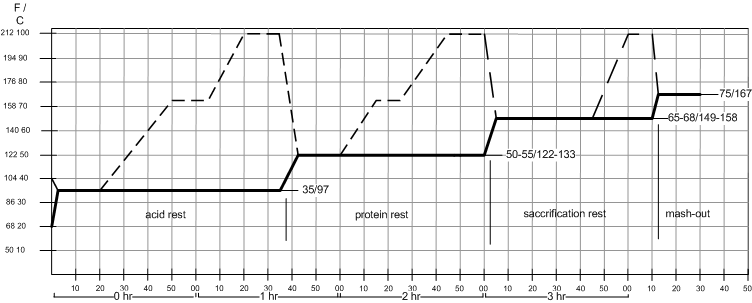
```


---
class: center, middle

# Modern Brewing Approaches - Stove Brewing

```{r}
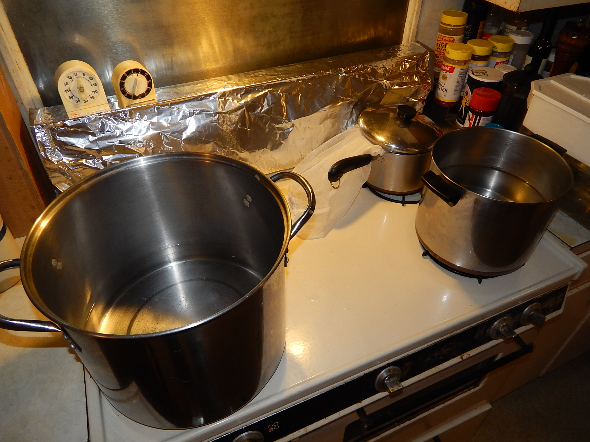
```


---
class: center, middle

# Modern Brewing Approaches - Direct Fire

```{r fig.height=2}
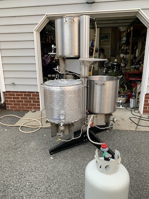
```


---
class: center, middle

# Modern Brewing Approaches - RIMS Systems

```{r}
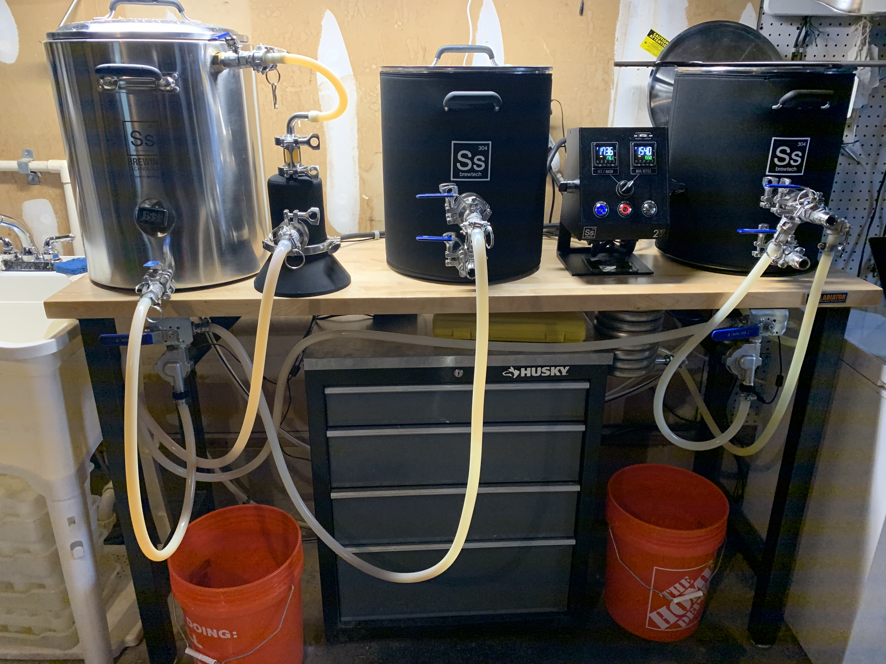
```


---
class: center, middle

# RIMS - Recirculation for Step Mash & Clarity


```{r}
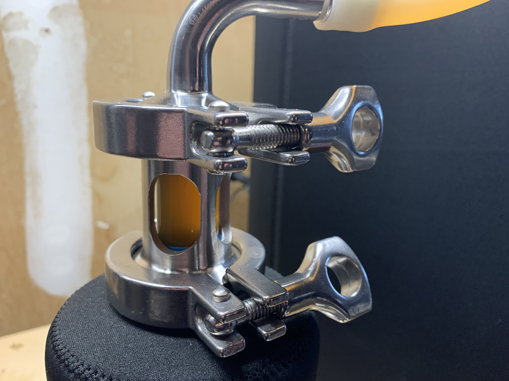
```


---
class: center, middle

# Modern Brewing Approaches - HERMS Systems

```{r}
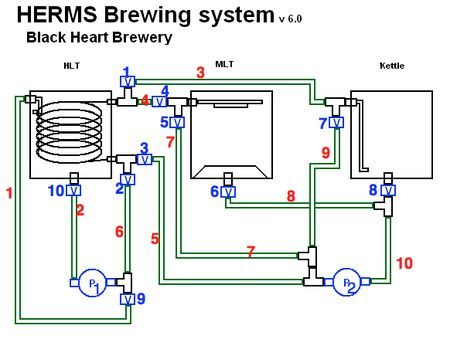
```


---
class: center, middle

# Boil in a Bag (BIAB)


```{r}
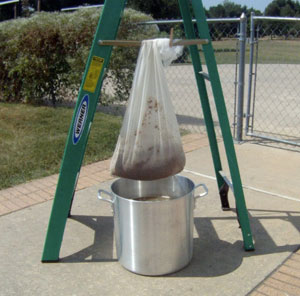
```


---
class: center, middle

# Fermentation


.pull-left[
```{r}
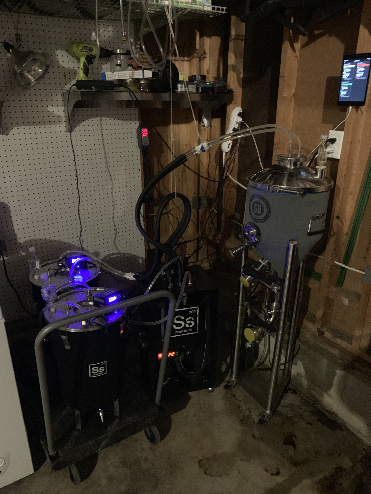
```
]

.pull-right[
```{r}
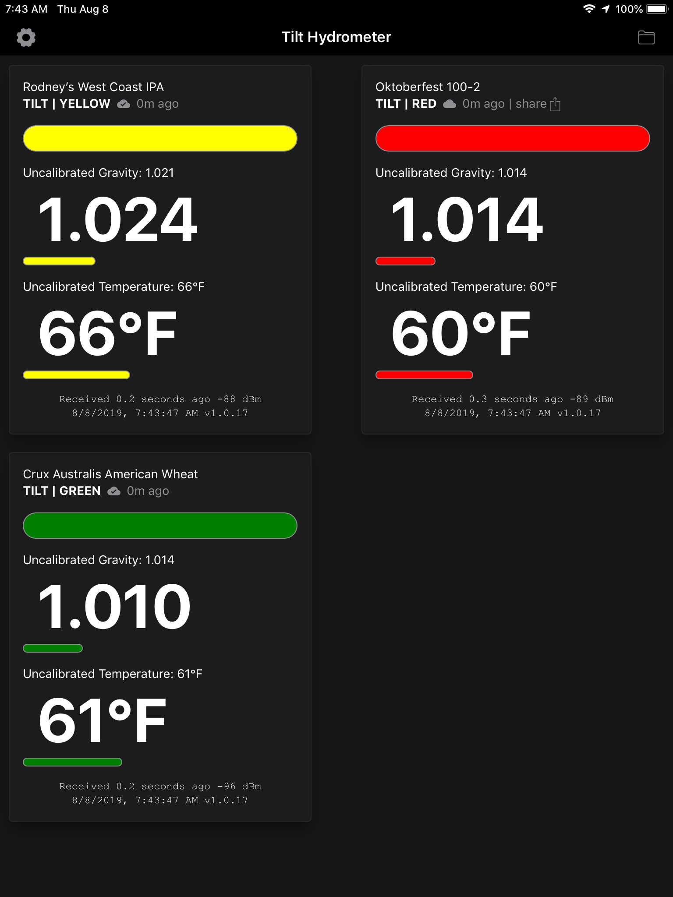
```
]


---
# Fermentation Profile

```{r}
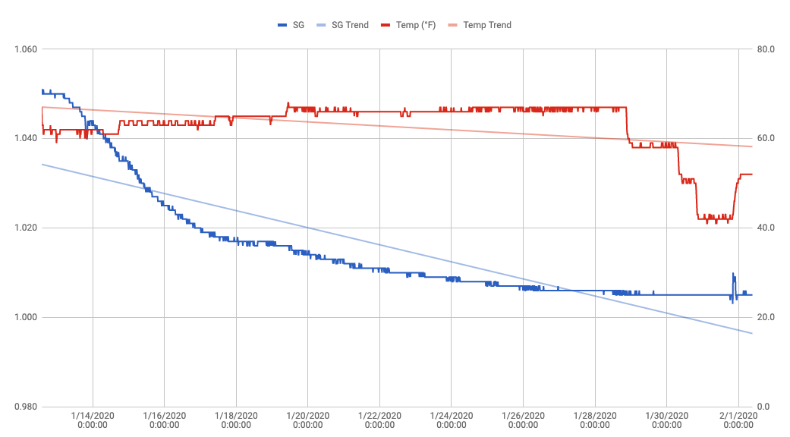
```


---
class: inverse, center, middle

# Let's Experiment!


---
# Sugar Conversion Efficiency

What we are going to do today is look at the way that each amylase enzyme influences the final quality of the fermentation product (e.g., the beer).

For this we will divide the crushed grain into two groups, the $\alpha$ group & the $\beta$ group.

  **Group $\alpha$:** Heat strike water to 145 °F  
  **Group $\beta$:** Heat strike water to 158 °F.  

Each group will mash-in and maintain that temperature .footnote[*n.b.*, you may see a bit of temperature loss when you mash in, so bring the heat back up.].

Both groups will maintain conversion for 45 minutes and then lauter off the sweet wort.


---
# Outcomes

We can quantify the differences that we see by:  

- Sending samples over to HPLC to look at differential sugars, and/or  

- Thowing some yeast at the situation and fermenting the samples.


